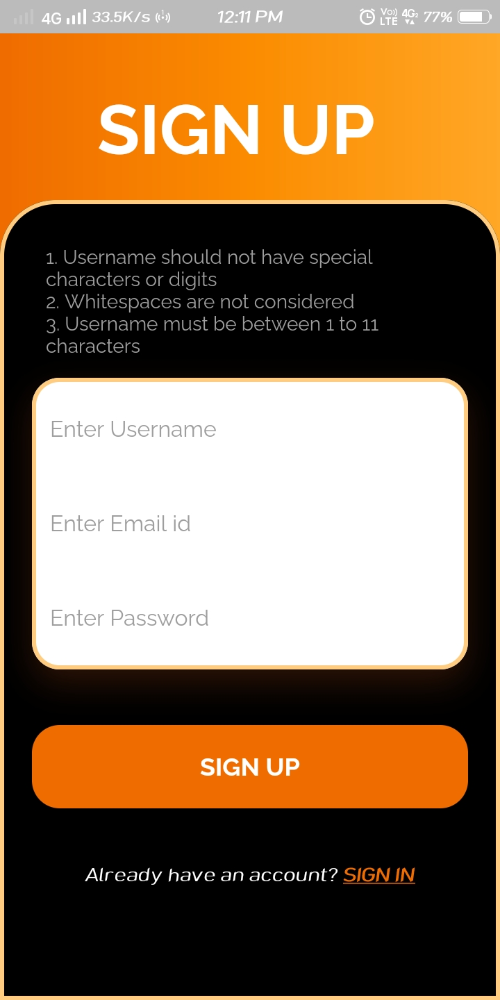
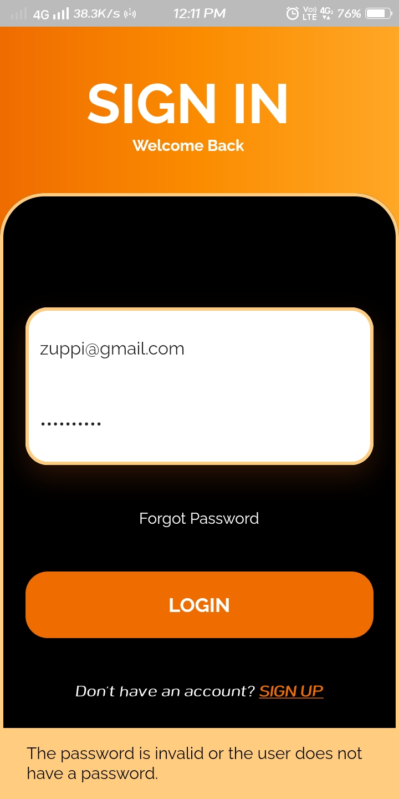
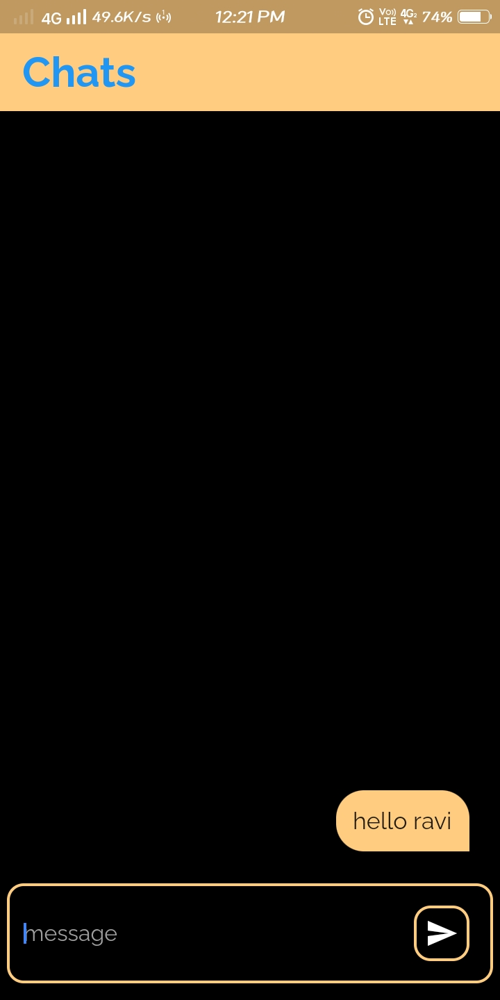
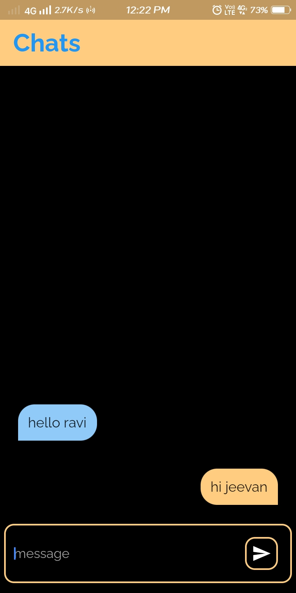

# Chats--A-Messaging-App
This is a messaging android application build in dart programming using flutter.

#### Language - Dart
#### SDK - Flutter
#### Database - Firebase
#### IDE - Visual Studio Code

  
   
  

  
   
  

  
   
  

